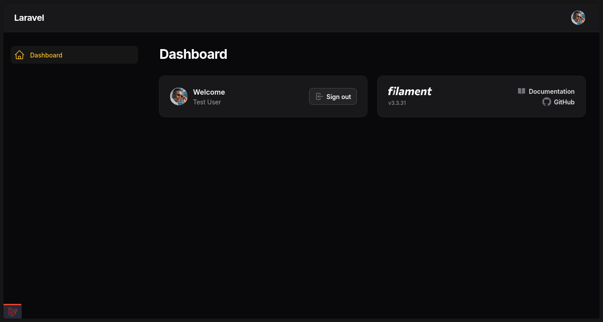

[](https://github.com/SantosVilanculos/skeleton-filament/actions)
[](https://packagist.org/packages/santosvilanculos/skeleton-filament)
[](https://packagist.org/packages/santosvilanculos/skeleton-filament)
[](https://github.com/SantosVilanculos/skeleton-filament/blob/main/LICENSE)



The skeleton application for the [Laravel framework](https://laravel.com/) and [Filament](https://filamentphp.com/).

```sh
laravel new --using=santosvilanculos/skeleton-filament
```
